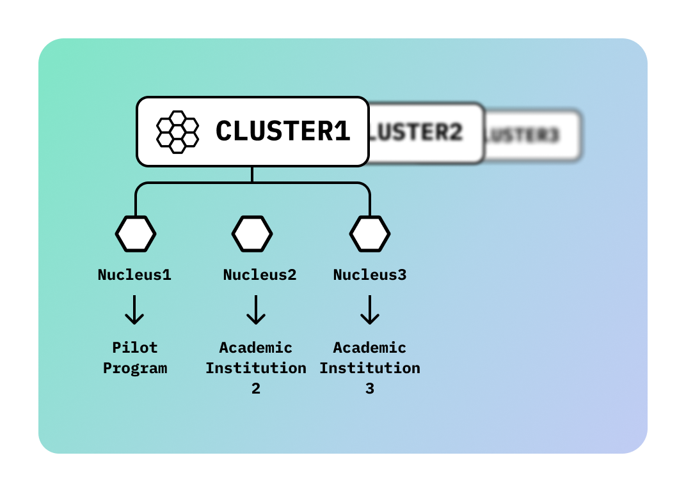

# DataHive Nodes

In the DataHive ecosystem, decentralized nodes play a crucial role in managing data, ensuring security, and facilitating seamless interactions between various components. These nodes empower users by decentralizing control over data and enabling a more equitable and transparent legal framework. By distributing control across multiple nodes, DataHive reduces reliance on centralized entities, ensuring that users maintain sovereignty over their personal information.

## Node Types

1. **[Legalese Nodes](https://github.com/datahiv3/Legalese-Nodes)**: These nodes focus on legal data indexing and curation within the DataHive network. They harness AI-driven insights to ensure that legal documents are processed and stored securely, providing users access to essential legal intelligence layers.
   
2. **[Consent Nodes](https://github.com/datahiv3/Consent-Nodes)**: These nodes manage user permissions and consent across the entire ecosystem. They ensure compliance with global privacy regulations like GDPR, maintaining user sovereignty over their data. Consent nodes facilitate the secure sharing of data while respecting user preferences.

## Benefits of Decentralized Nodes

### 1. Enhanced Security
By distributing data across multiple nodes, DataHive reduces the risk of data breaches or unauthorized access. Each node operates independently, creating a secure environment for sensitive information. The decentralized nature ensures that no single point of failure can compromise the system.

### 2. User Empowerment
Decentralized nodes allow users to maintain control over their data. Unlike traditional centralized systems where decisions about data usage are made by third parties, DataHive places these decisions directly in the hands of users. This empowers individuals and organizations to dictate how their information is stored, shared, and utilized.

### 3. Compliance and Transparency
DataHive ensures that all data-related transactions are transparent and auditable by utilizing decentralized nodes. This builds trust among users and ensures adherence to legal regulations such as GDPR. Every action taken within the network is recorded immutably on the blockchain, making it easy to verify compliance.

## Interaction with Other Components

Decentralized nodes interact seamlessly with other elements of the DataHive ecosystem:

- **On-Device AI**: AI running on user devices communicates with decentralized nodes to provide real-time data processing and insights. This ensures that users can benefit from personalized AI without compromising their privacy.
  
- **Blockchain Integration**: Nodes leverage blockchain technology to secure transactions and ensure data integrity across the network. Blockchain provides an immutable ledger where all interactions are recorded transparently, further enhancing security and trust.

This collaborative structure makes DataHive a powerful tool for managing and utilizing legal information in a privacy-centric manner.