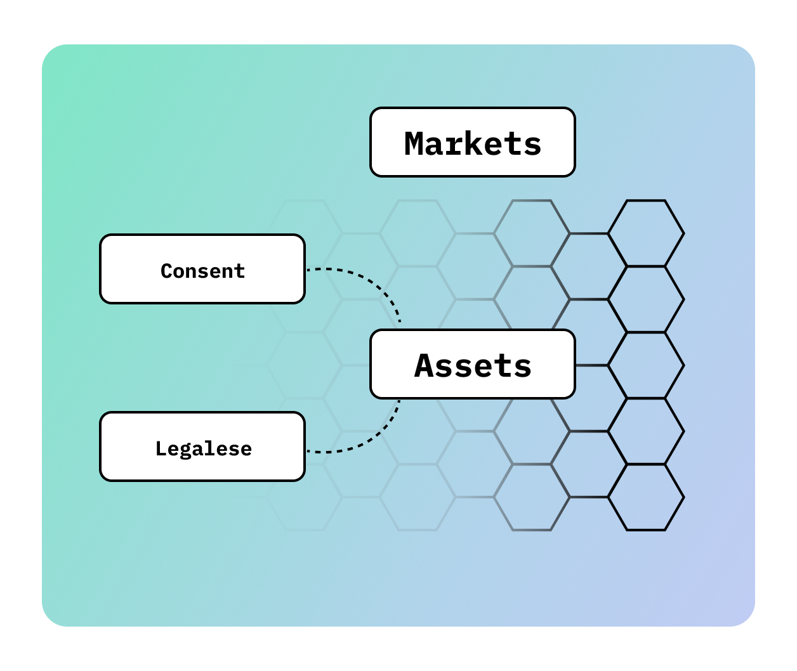

# Seamless Connectivity

In the DataHive ecosystem, **Seamless Connectivity** is a crucial feature that allows On-Device AI to interact securely with external resources. By enabling connections to decentralized networks—such as blockchains and Web2 services—DataHive ensures users can leverage a wide array of resources while maintaining privacy and control over their personal information.

This ability to connect seamlessly with these external systems empowers users to access advanced functionalities without compromising their data security. Whether it's retrieving legal data from decentralized nodes or performing secure transactions on blockchain networks, Seamless Connectivity ensures that user data remains private and protected.

## Key Features

- **Secure Connections**: DataHive establishes secure, encrypted connections to external resources, ensuring that user data is not exposed during interactions. This protects against unauthorized access and ensures the integrity of your data.
  
- **Privacy Preservation**: While facilitating access to broader ecosystems, DataHive ensures that the user’s data remains private. Only the necessary information is shared with external networks, adhering to the principle of data minimization.
  
- **Enhanced Usability**: The ability to connect with decentralized nodes and blockchain networks enhances the overall user experience, providing more opportunities for data utilization without sacrificing privacy.

## Examples of Seamless Connectivity

Seamless Connectivity enhances user experience in several ways:

- **Decentralized Nodes**: When accessing legal frameworks or specific data repositories, On-Device AI connects to decentralized nodes, retrieving necessary information while keeping sensitive user data secure. This allows users to benefit from legal intelligence layers without exposing their private information.
  
- **Blockchain Integration**: Users can perform secure transactions within the DataHive ecosystem, leveraging blockchain for verification and transparency while their personal data remains private. Blockchain ensures that all interactions are recorded immutably without compromising user privacy.