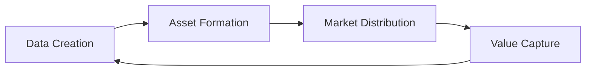

# Regenerative Economics in DataHive

## Overview

DataHive's regenerative economic model creates a self-sustaining ecosystem where value flows continuously between participants while maintaining long-term sustainability and growth.

## Core Principles

### Value Creation Cycles
- **Data Generation**
  - Continuous creation of valuable data assets
  - Automated data packaging and categorization
  - Quality-driven pricing mechanisms
- **Asset Transformation**
  - Raw data to structured assets
  - Individual data to aggregate insights
  - Local knowledge to network intelligence

### Sustainable Growth Mechanisms
- **Capital Inflows**
  - Enterprise subscription revenue
  - Data marketplace transactions
  - Network service fees
- **Value Distribution**
  - Automated revenue sharing
  - Participant rewards
  - Network maintenance incentives

## Economic Flows

### Primary Value Streams

### Participant Interactions
- **Data Providers** → **Enterprises**
  - Direct data sales
  - Usage licensing
  - Insight sharing
- **Enterprises** → **Network**
  - Service fees
  - Subscription payments
  - Infrastructure support
- **Network** → **Participants**
  - Reward distribution
  - Service credits
  - Growth incentives

## Token Mechanics

### Value Capture
- **Transaction Fees**
  - Percentage-based fee structure
  - Volume-based adjustments
  - Market-responsive rates
- **Service Payments**
  - Computational resources
  - Storage allocation
  - Network services

### Value Distribution
- **Reward Pools**
  - Data provider rewards
  - Node operator incentives
  - Developer grants
- **Growth Incentives**
  - Network expansion bonuses
  - Quality improvement rewards
  - Innovation grants

## Sustainability Features

### Economic Stability
- **Price Stability**
  - Algorithmic supply management
  - Demand-driven minting
  - Strategic reserves
- **Market Balance**
  - Supply/demand equilibrium
  - Fair value discovery
  - Market maker incentives

### Growth Drivers
- **Network Effects**
  - Increasing participant value
  - Growing data utility
  - Expanding service offerings
- **Innovation Incentives**
  - Development grants
  - Research funding
  - Protocol improvements

## Metrics & Monitoring

### Key Indicators
- **Network Health**
  - Transaction volume
  - Active participants
  - Value creation rate
- **Economic Stability**
  - Token velocity
  - Price stability
  - Reserve ratios

### Performance Tracking
- **Growth Metrics**
  - User acquisition
  - Data volume
  - Revenue generation
- **Sustainability Metrics**
  - Resource utilization
  - Cost efficiency
  - Value retention

## Future Development

### Roadmap
- **Phase 1**: Core economic mechanisms
- **Phase 2**: Advanced value capture
- **Phase 3**: Cross-chain integration
- **Phase 4**: Global scaling

### Research Initiatives
- Economic model optimization
- New value creation mechanisms
- Cross-network synergies

## Implementation Guidelines

### For Developers
- [Economic API Documentation](EconomicAPI.md)
- [Integration Examples](IntegrationExamples.md)
- [Testing Framework](TestingFramework.md)

### For Participants
- [Participation Guide](ParticipationGuide.md)
- [Reward Mechanisms](RewardMechanisms.md)
- [Value Creation Guide](ValueCreation.md)

## Additional Resources
- [Economic Whitepaper](Whitepaper.md)
- [Technical Documentation](TechnicalDocs.md)
- [Research Papers](Research.md)

## Regenerative Economics

DataHive's tokenomics emphasizes sustainable growth through:

- Continuous value creation through data generation and data assetization.
- External capital inflows from pure users of the network.
- Self-sustaining cryptoeconomic mechanisms based on reliable node operations.

### Importance of Node Reliability
The performance and reliability of nodes in the DataHive ecosystem directly impacts our regenerative economics model. When nodes operate effectively, they contribute to a smooth user experience and maintain data integrity, which are vital for attracting and retaining ecosystem users. Conversely, unreliable nodes can drain resources and reduce trust in the network, negatively affecting economic growth.

Thus, ensuring node reliability is not just a technical necessity but a key economic strategy for DataHive's growth and sustainability.