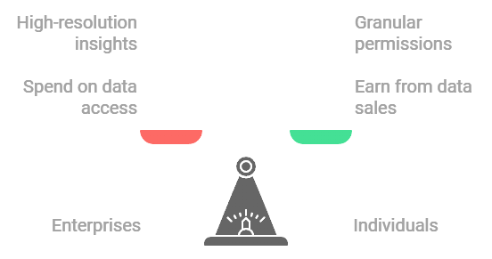
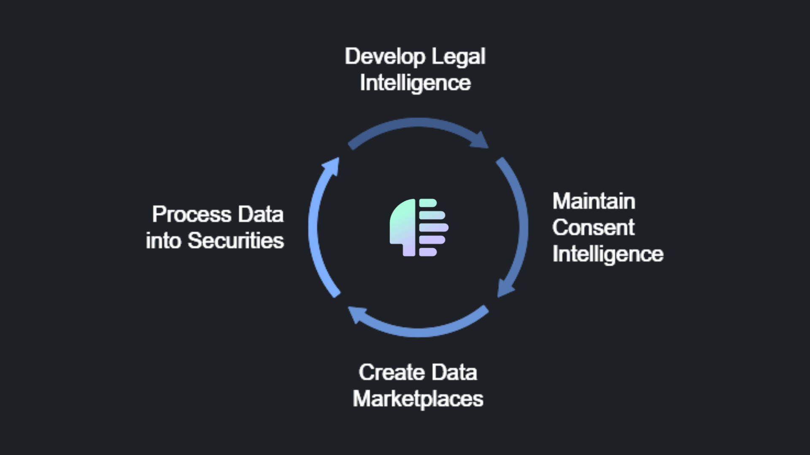

# Tokenomics of DataHive

The **DataHive Token (DH)** powers a dynamic ecosystem where enterprises and individuals can participate in secure, compliant data exchange while ensuring privacy and ownership rights.

## Token Flow by Participant Type

### Enterprises
- **Spend DH tokens to**:
  - Purchase or license consumer data directly from users
  - Access high-resolution consumer insights
  - Deploy targeted marketing campaigns
- **Earn DH tokens by**:
  - Selling their own packaged data assets
  - Offering valuable consumer insights
  - Contributing to the ecosystem's intelligence and knowledge models

### Individuals
- **Earn DH tokens by**:
  - Packaging and selling data assets
  - Licensing data rights 
  - Setting granular permissions for data usage
- **Control their data through**:
  - Selective data sharing options
  - Revenue-sharing in downstream uses

### Developers
- **Spend DH tokens to**:
  - Access intelligence and knowledge models
  - Utilize network APIs and services
  - Deploy applications on the network
- **Earn DH tokens by**:
  - Creating applications and tools
  - Contributing to ecosystem development
  - Building new data assetization solutions
- [Learn more about Developer Economics](./docs/DeveloperTokenomics.md)

### Node Operators

- **Legalese Nodes**: Earn by developing and maintaining DataHive's legal intelligence
- **Consent Nodes**: Earn by developing and maintaining the network's consent intelligence
- **Data Assetization Nodes**: Earn by developing and maintaining agentic marketplaces
- **Data Securitization Nodes**: Earn by processing data assets into securities
- [Learn more about Node Tokenomics](./docs/NodeTokenomics.md)

## Regenerative Economics

DataHive's tokenomics emphasizes sustainable growth through:
- Continuous value creation through data generation and data assetization
- External capital inflows from pure users of the network
- Self-sustaining cryptoeconomic mechanisms
- [Learn more about our Economic Design](./docs/RegenerativeEconomics.md)

For detailed information about specific participant types and their roles in the ecosystem:
- [Enterprise Token Usage](./docs/EnterpriseTokens.md)
- [Individual Token Usage](./docs/IndividualTokens.md)
- [Developer Token Usage](./docs/DeveloperTokenomics.md)
- [Node Operator Economics](./docs/NodeEconomics.md)
