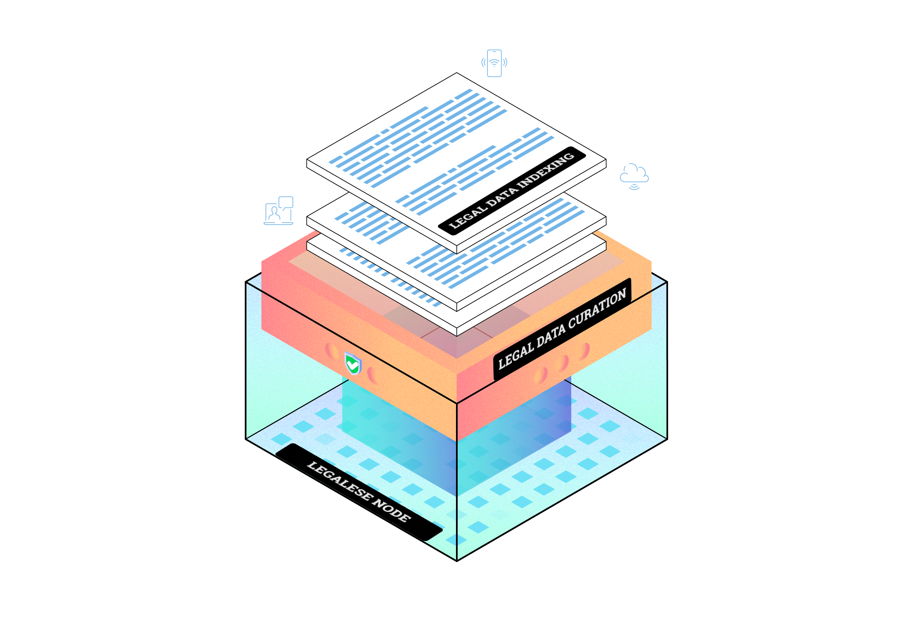

# Blockchain Integration

## Description

Blockchain integration is a cornerstone of the DataHive ecosystem, enabling secure, transparent, and decentralized interactions. At its core, DataHive utilizes blockchain technology to empower users with control over their data while ensuring compliance with legal frameworks. This integration not only enhances the overall security of data transactions but also promotes trust and accountability within the network.

By leveraging blockchain, DataHive decentralizes data ownership, allowing individuals and enterprises to maintain control over their information without relying on centralized authorities. This ensures that all interactions within the ecosystem are secure, transparent, and immutable.

## Key Features

- **Decentralization**: Blockchain enables DataHive to decentralize data ownership. Users maintain full control over their personal information without needing to trust centralized entities.
  
- **Secure Transactions**: Blockchain provides a secure framework for transactions within the DataHive ecosystem. Encrypted transactions ensure that data is protected from unauthorized access or tampering.

- **Transparency and Immutability**: All transactions are recorded on an immutable ledger, creating a transparent system where every action is traceable and verifiable. This enhances accountability and builds trust within the network.

## Benefits of Blockchain Integration

### 1. User Empowerment
Blockchain integration puts users in control of their data. By decentralizing data ownership, individuals and enterprises can decide how their information is shared and used. This fosters a sense of ownership and responsibility while reducing reliance on third-party intermediaries.

### 2. Enhanced Security
Blockchain’s encrypted transactions and decentralized storage significantly reduce the risk of data breaches or unauthorized access. By eliminating single points of failure, DataHive ensures that user data remains secure at all times.

### 3. Regulatory Compliance
Blockchain’s transparent nature helps ensure compliance with global regulations like GDPR. Users have clear visibility into how their data is being used and can exercise their rights more effectively (e.g., requesting deletion or modification of their data). Blockchain also provides an auditable trail that demonstrates compliance with privacy laws.

## Integration with DataHive

DataHive's blockchain integration allows various components of the ecosystem to interact seamlessly:

- **Legalese Nodes**: These nodes leverage blockchain for legal data indexing and curation, ensuring that all actions are recorded accurately and transparently. Legalese Nodes create an immutable record of legal interactions within the network.
  
- **Consent Management**: Blockchain technology is employed to manage user consent across the ecosystem. This ensures that permissions are respected and easily verifiable, allowing users to revoke or modify consent at any time while maintaining compliance with privacy regulations like GDPR.

## Visual Representation

Here’s a visual representation of how blockchain integrates into the DataHive ecosystem:

This image illustrates how Legalese Nodes, Consent Management, and other components work together using blockchain technology to ensure secure and transparent operations.